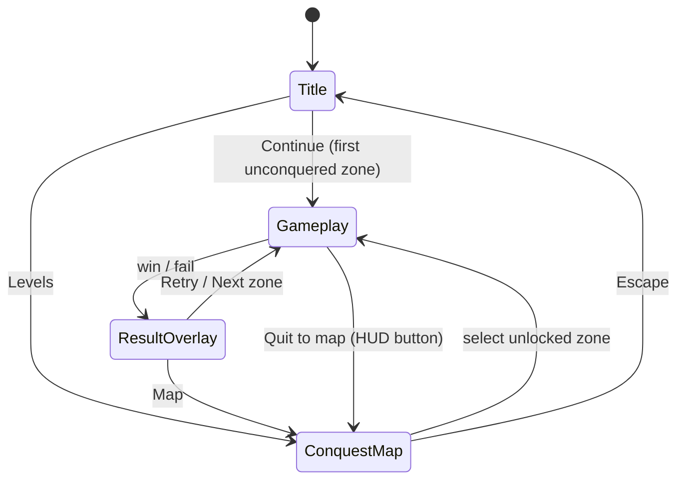

# Castle Siege (working title) — Game Specification v1.0

A single-player, physics-destruction siege game for **Meta Ray-Ban Display** glasses,
controlled entirely with **Meta Neural Band** gestures. The player besieges an enemy
castle from the outer rim inward, zone by zone, until the King falls.

- Repo: `catapult-glass` · In-game title: **TBD** (open question Q-10)
- Status: **Specification approved — pre-implementation**
- Audience: this document is normative for all implementation sessions. Sections 2 and
  5.4 use MUST/MUST NOT language; do not re-litigate decisions recorded here without
  updating this file first.

---

## Table of contents

1. [Overview](#1-overview)
2. [Platform constraints (normative)](#2-platform-constraints-normative)
3. [Game design](#3-game-design)
4. [UI and user flow](#4-ui-and-user-flow)
5. [Technical architecture](#5-technical-architecture)
6. [Out of scope (v1)](#6-out-of-scope-v1)
7. [Risks and open questions](#7-risks-and-open-questions)
8. [Milestones](#8-milestones)

---

## 1. Overview

| | |
|---|---|
| Genre | Angry-Birds-style 2D physics destruction |
| Fiction | Medieval castle siege campaign: conquer the castle zone by zone, defeat the King |
| Platform | Meta Ray-Ban Display (web app on glasses) + Meta Neural Band (input) |
| Session length | 1–5 minutes ("in-between moments" play) |
| Content | 8–10 handcrafted levels (castle zones) |
| Scope bar | Polished mini-game — quality over quantity |
| Art | Pixel art, medieval-siege theme, 200×200 logical px scaled ×3 |
| Tech | Vanilla JS + Canvas 2D + matter.js, no build step, static HTTPS hosting |

### The story in one paragraph

You are a lone siege engineer at the edge of the enemy kingdom. The castle before you
is ringed in defenses: low wooden palisades at the outer rim, stone gatehouses further
in, and at the center — the keep, where the King hides behind his strongest walls.
Each zone you bombard and conquer plants your banner closer to the throne. Topple the
King, and the realm is yours.

---

## 2. Platform constraints (normative)

These are verified facts about the platform (June 2026, Meta Wearables web-app toolkit).
Implementation MUST respect all of them.

### 2.1 Display

- Fixed **600×600 px** viewport, monocular (right lens), 20° field of view, 90 Hz,
  full color, 42 pixels per degree.
- **Additive display: pure black (`#000`) renders as transparent.** The game MUST use a
  pure-black background and MUST NOT encode gameplay information in dark-vs-darker
  contrast.
- Required HTML scaffolding:
  - `<meta name="mrbd-web-app-capable" content="yes">`
  - `<meta name="viewport" content="width=600, height=600">`
  - Web app manifest with `"display": "standalone"`
  - PNG favicon ≥52×52 (no SVG)

### 2.2 Input — discrete events only

The Neural Band translates gestures into keyboard events. Apps receive **only**:

| Gesture | DOM event received |
|---|---|
| Thumb swipe up/down/left/right | `keydown` ArrowUp / ArrowDown / ArrowLeft / ArrowRight |
| Index-finger pinch | `keydown` Enter |
| Middle-finger pinch | `keydown` Escape (Back) |

- **No touch, no pointer events.**
- **The native pinch+twist dial gesture is system-reserved** and is NOT exposed to apps.
  Raw EMG never leaves the band; only discrete events arrive. **Verified in Phase 0:**
  twisting only drove the **system volume dial** — no app-visible events — so the planned
  `TwistSource` is **dropped**; power stays on the swipe-driven slider.
- **Verified in Phase 0:** swipes arrive as single `keydown` events with **no auto-repeat**
  (reliable in every direction and at any speed), and a *held* pinch yields no reliable
  `keyup`/hold event. All tunables work in single discrete steps; the design MUST NOT
  depend on `keyup` (rule: **no hold-to-charge mechanics**).
- Continuous sensors that DO exist (glasses head IMU via DeviceOrientation/DeviceMotion,
  phone GPS) are **explicitly unused** by this game. Head-aiming was considered and
  rejected for comfort and precision reasons.

### 2.3 Deployment

- Host as static files at a **public HTTPS URL** (GitHub Pages).
- Installed on glasses via the Meta AI app (QR deep link or manual URL add).
- Development happens in a desktop browser at 600×600 with arrow keys/Enter/Escape —
  the exact same code path as the device (no separate simulator layer).
- Distribution today is URL-sharing only; there is no app store yet.

---

## 3. Game design

### 3.1 Campaign structure — the siege

Each level is one **zone** of the enemy castle. Difficulty ("security level") rises
from the outer rim toward the center:

| Zone | Name (working) | Teaches / features | Defenses |
|---|---|---|---|
| 1 | Outer Rim | Angle control | Low wooden palisades, 1 defender |
| 2 | Watch Post | Power control | Taller wood towers |
| 3 | Granary | Glass (shatters, bonus points) | Wood + glass |
| 4 | Gatehouse | Stone shields → arc shots | First stone plates |
| 5 | Barracks | Chain collapse (topple supports) | Wood towers on pillars |
| 6 | Inner Ward | TNT crates | Mixed, TNT placed as tool/hazard |
| 7 | Armory | Composite puzzle | Stone + TNT + glass |
| 8 | Keep Wall | Heavy shielding | Mostly stone, narrow openings |
| 9 | Keep | Multi-stage collapse | Everything combined |
| 10 | Throne Room | **Final: the King** | Heavily shielded, multi-hit King target |

(8 levels minimum to ship; 9–10 if the content phase has room. Zone names/details are
the level designer's to refine — the teaching order is normative.)

### 3.2 Core loop

```
AIM (set angle + power) → FIRE → FLIGHT (physics plays out) → SETTLE (bodies come to rest)
  → more defenders left & shots left? → AIM
  → all defenders destroyed?            → RESULT: win (stars)
  → shots exhausted, defenders remain?  → RESULT: fail (retry)
```

- Per level: **3–5 projectiles** (boulders), **1–3 defenders** (targets) that must ALL
  be destroyed to win.
- Defenders are enemy units/crest banners themed to the zone; the final level's defender
  is the **King** (higher HP — takes 2–3 solid hits).

### 3.3 Controls (single mode — locked decision)

There are no control modes. Every gesture always does the same thing during aiming:

| Gesture | Event | Aim phase | Menus/overlays |
|---|---|---|---|
| Swipe up / down | ArrowUp/Down | **Angle** +5° / −5° (clamped 10°–80°) | Focus prev / next |
| Swipe left / right | ArrowLeft/Right | **Power** −1 / +1 (10 steps) | Focus left / right |
| Pinch | Enter | **Fire** | Activate focused item |
| Middle pinch | Escape | **System Back/pause menu** (OS-owned) | Back |

- 15 angle steps × 10 power steps; worst case ~12 swipes to reach any aim. All steps
  are discrete (see §2.2).
- **Power slider UI**: a horizontal **pill-shaped track** beside the catapult. The
  **filled portion** (from the left end up to the knob) is the value *indicator* and
  carries a **green→red gradient anchored across the whole track** (green at the low/left
  end → red at the high/right end), so the fill's leading-edge color signals shot
  strength; the unfilled remainder is a dim track. A **circular knob** rides at the fill's
  leading edge — the knob is a single neutral color, since the gradient lives on the fill,
  not the knob. The power number sits beside the track. Swipe left/right moves the knob
  (left = weaker, right = stronger), matching the gesture direction. (Drop shadows are
  omitted — dark pixels are invisible on the additive display, §2.1.) Phase 0 confirmed the
  twist gesture is the **system volume dial** (no app events), so there is no twist binding —
  power stays on swipes.
- **Trajectory preview**: dotted preview of the first ~40% of the flight arc, updated
  live while aiming. MUST be computed from the same physics constants as the
  simulation (gravity, launch velocity from power step) — not a separate approximation.
- During FLIGHT/SETTLE, the app ignores all input; **pausing is OS-driven** — the system
  Back/menu fires the platform `pause`/`resume`/`stop` lifecycle events (§4.1), not our Escape
  handler. **Phase 0 confirmed no display dimming/throttling during the passive flight phase, so
  the "skip to settle" fallback is not needed.**
- **Phase 0 note (platform):** the middle-pinch / Back gesture surfaces the fixed system
  **"universal Web App menu" (Restart · Resume · Skip Level)** rather than passing cleanly to the
  app. **Resolved (Q-11):** the system menu *is* the pause — the app reacts to the platform
  `pause`/`resume`/`stop` lifecycle events instead of drawing its own overlay (§4.1).

### 3.4 Materials and destruction

| Material | Role | HP / behavior | Points |
|---|---|---|---|
| **Wood** | Default structure | Medium; breaks at moderate impact | 100 |
| **Stone** | Shields, forces arc shots | Very high; rarely breaks (per-level may be unbreakable) | 300 |
| **Glass** | Risk/reward filler | Shatters at light impact | 200 |
| **TNT crate** | Puzzle tool | Explodes on solid impact: radial impulse + area damage | 150 |
| **Defender / King** | Win condition | Defender: 1 solid hit; King: multi-hit, pulsing highlight | 500 / 2000 |

- **Damage model**: each block has HP; on collision,
  `damage = max(0, impactImpulse − materialThreshold)`. At HP ≤ 0 the block is removed
  and replaced by a **particle burst** — destroyed blocks MUST NOT spawn debris bodies
  (performance budget, §5.1).
- **TNT**: on detonation, applies a radial impulse to bodies within radius R and flat
  damage falling off with distance. The only toolkit item requiring dedicated code.
- Level-design toolkit (no extra code needed): **chain-collapse structures** (topple a
  support pillar → tower falls on the target) and **stone shields** (block direct shots,
  forcing high-arc lobs). **Wind was considered and rejected** (breaks trajectory
  preview trust, tuning cost).

### 3.5 Scoring and stars

- Score = sum of destroyed-material points + **1000 per unused projectile**.
- Stars per level: **1★ = win**, 2★/3★ = score thresholds defined in level data
  (rule of thumb: 3★ ≈ winning with ≥1 projectile to spare).
- Beating zone N (1★) unlocks zone N+1. Persistence: best score + stars per zone
  (§5.6). Debug: `?unlock=1` opens all zones.

### 3.6 Level design guidelines (600×600 monocular legibility)

- One static screen per level. **No camera scrolling or zoom.**
- Catapult fixed at bottom-left (≈ logical x 20, ground at logical y 180); structures
  occupy the right two-thirds.
- Minimum block size **8 logical px** (24 device px); ≥5 logical px gap between distinct
  structures; **≤25 dynamic bodies** per level (performance + readability cap).
- HUD text ≥20 device px; keep a 16-device-px margin from all screen edges (lens-edge
  legibility — verified in Phase 0).
- Every level must be solvable with ≥2 projectiles remaining by a perfect player
  (3★ must be earnable).

---

## 4. UI and user flow

### 4.1 Screens



- **Title**: game logo + two options: **Continue** (focused by default — one pinch from
  launch to gameplay) and **Levels**.
- **Conquest map** (level select): top-down pixel-art castle with concentric zones.
  Conquered zones show the player's banner + earned stars; the next zone pulses;
  locked inner zones are dimmed. D-pad navigable in a fixed focus order (outer → inner).
- **Gameplay**: canvas scene with substates Aim → Flight → Settle → Result.
- **Result overlay**: stars animation, score, Retry / Next / Map.
- **Pause (platform-native)**: on the glasses the middle-pinch raises the fixed system
  **"universal Web App menu" (Restart · Resume · Skip Level)** — the app draws **no** pause
  overlay; it reacts to the platform **`pause` / `resume` / `stop`** lifecycle events (freeze the
  loop on `pause`, continue on `resume`, reset the zone on `stop`). Desktop mirrors this via the
  **Page Visibility API** (tab switch) for an identical code path. **"Quit to map"** — the one
  action the system menu lacks — is an in-app **focusable HUD button** (pinch/Enter), never bound
  to Back.

### 4.2 Gameplay HUD

- Top-left: score. Top-right: remaining projectiles as a `SHOTS left/total` readout
  (e.g. `SHOTS 3/3`).
- Bottom-left, beside the catapult: **angle readout** (e.g. `45°` with a short direction
  tick) and the **power slider** (horizontal pill track, 10 steps; green→red gradient fill
  as the value indicator; circular knob).
- All HUD elements ≥20 device px, inside the 16 px safe margin.

---

## 5. Technical architecture

### 5.1 Physics: matter.js (vendored, pinned)

- Stable block **stacking** is the hard problem; it needs a sequential-impulse solver
  with warm starting and sleeping. Writing custom physics is the project's single
  biggest schedule risk — rejected. matter.js is ~26 KB gzip, battle-tested for exactly
  this genre, and loads from one file with no build step.
- Physics steps at a **fixed 60 Hz** via an accumulator; rendering interpolates body
  positions at whatever rAF rate the device provides. **Phase 0 measured ~30 fps on-device
  (stable, min 29.9)** — not the 90 Hz panel rate — so decoupling physics from the render
  rate (via this accumulator) is essential.
- Sleeping enabled; solver iterations capped (`positionIterations: 6`,
  `velocityIterations: 4`); ≤25 dynamic bodies/level; no debris bodies.
- Fallback knobs if needed: 30 Hz physics, lower iteration counts, lower body cap.
  **Phase 0 result:** physics steps measured **~0.5 ms (max 0.8 ms under load)** — far under
  the ≤4 ms budget — so the 30 Hz-physics fallback is **not needed**; physics stays at 60 Hz.

### 5.2 Rendering: Canvas 2D, pixel-art pipeline

- One fullscreen 600×600 `<canvas>`; internal logical resolution **200×200**, drawn
  ×3 with `ctx.imageSmoothingEnabled = false` (+ CSS `image-rendering: pixelated`).
  Integer scaling keeps pixels crisp; chunky pixels aid readability at 42 ppd.
- Custom renderer reads matter.js body positions (Matter.Render is debug-only — not used).
- Single spritesheet PNG (`assets/sprites.png`) + JSON atlas. Until Phase 3, colored
  placeholder rectangles with bright outlines.
- **Art direction rules** (additive display): pure `#000` background; bright, saturated
  palette; every sprite carries a bright 1-logical-px outline; avoid large
  full-brightness areas (glare/battery); defenders/King pulse for salience.
- DOM is used **only** for menus/overlays (`.screen` divs, `.focusable` +
  `tabindex="0"`, per Meta's toolkit pattern); the game scene is canvas-only.

### 5.3 Code: vanilla JS ES modules, no build step

TypeScript-grade safety via `// @ts-check` + JSDoc. Zero toolchain → GitHub Pages deploy
is "push to branch". (If the project outgrows this, Vite+TS is the documented escape
hatch — a deliberate non-decision for v1.)

```
index.html                  # meta tags, manifest link, canvas + screen divs
manifest.webmanifest
favicon.png                 # ≥52×52 PNG
vendor/matter.min.js        # vendored, version pinned in a comment
assets/sprites.png          # spritesheet (Phase 3)
src/main.js                 # boot, rAF loop, fixed-timestep accumulator
src/input.js                # input abstraction (§5.4)
src/screens.js              # screen stack + focus management
src/game.js                 # gameplay state machine (Aim/Flight/Settle/Result)
src/physics.js              # matter.js world, materials, damage, TNT
src/render.js               # canvas renderer (world, power slider, trajectory, HUD)
src/levels/index.js         # export const LEVELS = [...]
src/levels/level01.js …     # one module per zone
src/storage.js              # localStorage wrapper, versioned schema
src/audio.js                # optional, feature-detected
spike/index.html            # Phase-0 logger + benchmark (kept in repo)
docs/                       # this spec's companions
```

### 5.4 Input abstraction (load-bearing — MUST follow)

Two layers; gameplay code never reads DOM events directly.

- **Sources** translate raw DOM events → semantic actions.
  - `KeyboardSource` — serves desktop dev AND the Neural Band (the band emits real
    key events; one source covers both — deliberate simplification).
  - Future `TwistSource` — plugs in beside it if Phase 0 finds usable twist events.
- **Actions** consumed by screens/game:
  - Menus: `NAV_UP` `NAV_DOWN` `NAV_LEFT` `NAV_RIGHT` `SELECT` `BACK`
  - Aim phase: `ANGLE_INC` `ANGLE_DEC` `POWER_INC` `POWER_DEC` `FIRE` `PAUSE`
  - The active screen owns the action→meaning mapping; sources know nothing about
    gameplay.
- Contract: actions fire on `keydown`; `repeat` keydowns pass through flagged
  (consumers decide whether to honor); **nothing may depend on `keyup`**.

### 5.5 Level data format

JSON-shaped JS modules (no `fetch`, no async loading, schema discipline kept):

```js
// src/levels/level04.js
export default {
  id: "zone-04",
  name: "Gatehouse",
  projectiles: 4,
  starThresholds: [0, 5500, 8000],   // index 0 unused (1★ = win), then 2★, 3★ scores
  blocks: [
    { material: "wood",  x: 120, y: 160, w: 8, h: 24 },
    { material: "stone", x: 140, y: 150, w: 24, h: 8, angle: 0 },
    { material: "tnt",   x: 150, y: 170, w: 10, h: 10 },
  ],
  targets: [ { type: "defender", x: 150, y: 176, r: 6 } ],   // type: "defender" | "king"
  statics: [ { x: 100, y: 184, w: 100, h: 16 } ],            // ground extras, ramps
};
```

Coordinates are **logical 200×200 space, origin top-left, y grows downward** (matches
both canvas and matter.js — stated explicitly to prevent y-axis confusion).

### 5.6 Persistence

`localStorage` key **`catapult-glass.v1`**:
`{ zones: { [id]: { stars, bestScore } }, settings: {} }`.
Versioned key = schema migration is a new key + optional migration. All access wrapped
in try/catch — the game MUST run correctly with persistence unavailable (storage
behavior on the glasses webview is open question Q-7).

### 5.7 Testing strategy

- **Desktop browser (primary, every session)**: static server, page pinned to a black
  600×600 stage; arrow/Enter/Escape ARE the simulation (identical code path).
  Debug query params: `?level=N`, `?unlock=1`, `?fps=1` (perf overlay), `?slowmo=1`.
- **Automated**: `node --test` units for physics damage math, scoring, and level-schema
  validation (matter.js runs headless in Node). No E2E framework at this scope.
- **On-device checklist** (only what desktop can't verify):
  1. Real rAF rate + physics step time (spike benchmark)
  2. Swipe→action latency; auto-repeat behavior
  3. Pinch keydown/keyup semantics
  4. Legibility: 8-logical-px blocks, 20 px text, lens-edge margins, palette glare
  5. localStorage persistence across app relaunch
  6. Display dimming during the no-input Flight phase
  7. Battery/thermal over a 10-minute session
  8. System pinch menu: which items appear for our app, and what the `pause`/`resume`/`stop`
     lifecycle events (and "Restart" / "Skip Level") actually deliver — confirm pause/resume
     freezes and resumes the loop, and "Quit to map" works as a HUD button

---

## 6. Out of scope (v1)

Multiplayer/leaderboards · level editor · head-IMU aiming · geolocation features ·
wind modifier · camera scroll/zoom · debris physics bodies · projectile types/abilities ·
localization · app-store distribution · sound beyond optional feature-detected SFX ·
phone/desktop as supported play targets (dev-only).

---

## 7. Risks and open questions

| # | Risk / question | Impact | Mitigation | Resolves |
|---|---|---|---|---|
| Q-1 | Glasses CPU/GPU budget unknown | Physics/render may not hit frame rate | **Resolved (Phase 0):** physics ~0.5 ms/step (≪4 ms); render ~30 fps stable; 60 Hz physics kept | ✓ |
| Q-2 | Swipe auto-repeat unknown | Aiming feel | **Resolved (Phase 0):** no auto-repeat; single discrete steps confirmed | ✓ |
| Q-3 | Pinch keyup/long-press semantics unknown | Would break hold mechanics | **Resolved (Phase 0):** held pinch unreliable; keydown-only confirmed | ✓ |
| Q-4 | Twist gesture leakage (wheel/repeat events?) | Could restore original control vision | **Resolved (Phase 0):** twist = system volume, no app events; `TwistSource` dropped | ✓ |
| Q-5 | rAF throttling / display dimming during passive flight | Game looks frozen | **Resolved (Phase 0):** no dimming/throttling when idle; skip-to-settle not needed | ✓ |
| Q-6 | Web Audio availability/policy on glasses webview | SFX may be impossible | Audio optional + feature-detected | Phase 4/5 |
| Q-7 | localStorage persistence across relaunches | Progress loss | Wrapper degrades gracefully | Phase 5 |
| Q-8 | Distribution/review timeline (URL-only today) | Reach | None needed for v1; track | — |
| Q-9 | Toolkit/platform API drift (young platform) | Breakage | Re-verify meta-tag requirements at Phase 5 | Phase 5 |
| Q-10 | In-game title | Branding | Decide before Phase 4 title art | Phase 4 |
| Q-11 | Middle-pinch (Back) opens the fixed system "universal Web App menu" (Restart · Resume · Skip Level) | Could clash with an app-drawn pause overlay | **Resolved (Phase 2):** the system menu *is* the pause — the app reacts to `pause`/`resume`/`stop` lifecycle events and draws no pause overlay; "Quit to map" is an in-app HUD button | ✓ |

---

## 8. Milestones

One GitHub issue per phase; each phase ends in a committable, demoable state.
**Phase 0 is a gate for Phase 2** (content/system decisions depend on its findings).

| Phase | Sessions | Deliverable |
|---|---|---|
| **0 — Input & perf discovery spike** | 1–2 | `spike/index.html`: on-screen event logger (key/code/repeat, keydown→keyup timing, wheel), rAF delta stats, matter.js 50-box stress test, pixel-art legibility card (×2/×3/×4). Deploy to GitHub Pages, run on glasses, fill `docs/spike-0-input-discovery.md`, fold findings into §2.2/§5.1/§7 |
| **1 — Core loop prototype** | 2–3 | Scaffolding (meta tags, manifest), fixed-timestep loop, input abstraction, screen stack, one hardcoded zone with placeholder rectangles, aim UI (angle + dial + trajectory dots), launch/collisions, win/lose. Desktop-playable end to end |
| **2 — Game systems** | 2–3 | Materials/damage + TNT, scoring/stars, level schema + loader, Title + Conquest Map screens, persistence, pause/result overlays |
| **3 — Content & art** | 2–3 | Medieval spritesheet (catapult, blocks, defenders, King, map zones — designer collaboration; atlas format per §5.2), 8–10 zone levels, difficulty/star tuning |
| **4 — Polish** | 1–2 | Particle bursts, dial/HUD juice, title art, optional SFX, favicon/manifest final |
| **5 — Deploy & device validation** | 1–2 | GitHub Pages production deploy, QR onboarding, full on-device checklist (§5.7), fixes, tag `v1.0` |
